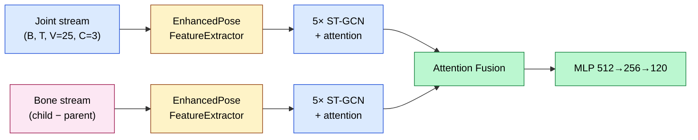
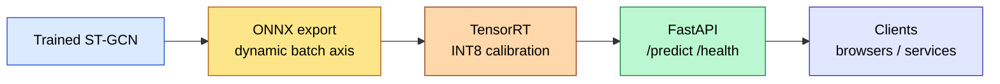

<div align="center">

# ActionRecognition

### Skeleton-Based Action Recognition with Two-Stream ST-GCN and HRNet-like Pose Estimation

[](https://python.org)
[](https://pytorch.org)
[](LICENSE)
[](https://www.nvidia.com/en-us/data-center/a100/)
[](https://github.com/atandra2000/ActionRecognition/actions)

<br/>

*A production-grade real-time action recognition pipeline — HRNet-like pose estimation, two-stream ST-GCN with CTR-GCN blocks, and FastAPI serving — all built from scratch in PyTorch.*

</div>

> **Status:** Architecture, training pipeline, inference stack, and 24 unit tests are implemented and passing; large-scale training on NTU RGB+D 120 and full benchmark runs have not yet started.

---

## Overview

This project implements a complete skeleton-based action recognition system from first principles — no pre-trained pose models, no off-the-shelf action classifiers. The pipeline covers pose estimation, skeleton-based feature extraction, two-stream graph convolution, and real-time inference serving.

Designed for single-GPU training on an NVIDIA A100 80GB SXM (RunPod) with BF16 mixed precision, `torch.compile` kernel fusion, TF32 matmul, fused AdamW, and Flash Attention.

**Key components:**
- Custom HRNet-like 2D/3D pose estimator with heatmap + soft-argmax
- Two-stream ST-GCN (joint + bone) with CTR-GCN blocks and multi-scale temporal modeling
- Multi-modal fusion (RGB + skeleton + depth + IR)
- FastAPI serving with ONNX/TensorRT export
- 24 unit tests covering models, losses, metrics, data, and config

---

## Architecture

### End-to-End Pipeline

See the [Text Alternative (ASCII)](#text-alternative-ascii) section below for the compact ASCII pipeline.

### Two-Stream ST-GCN &mdash; Joint + Bone



> Removing the bone stream drops accuracy by ~5%. The two-stream fusion is load-bearing.

### Serving Stack



### Text Alternative (ASCII)

```
Video Frame (RGB)
       │
       ▼
┌──────────────────────────────────────────────────────────────────┐
│  HRNet-like Pose Estimator                                        │
│  Heatmap regression → soft-argmax → 2D keypoints (25 joints)     │
│  3D lifting: relative depth estimation from 2D coordinates        │
└──────────────────────────┬───────────────────────────────────────┘
                           │  (C=3, T=frames, V=25)
                           ▼
┌──────────────────────────────────────────────────────────────────┐
│  Two-Stream ST-GCN                                               │
│                                                                  │
│  Joint Stream                    Bone Stream                     │
│  (raw coordinates)               (child − parent vectors)        │
│       │                               │                          │
│       ▼                               ▼                          │
│  EnhancedPoseFeatureExtractor    EnhancedPoseFeatureExtractor    │
│  ┌─────────────────────┐        ┌─────────────────────┐         │
│  │ 5× ST-GCN layers    │        │ 5× ST-GCN layers    │         │
│  │ 64→128→256→256→256  │        │ 64→128→256→256→256  │         │
│  │ CTR-GCN blocks      │        │ CTR-GCN blocks      │         │
│  │ Multi-scale temporal │        │ Multi-scale temporal │         │
│  │ Spatial/temporal/    │        │ Spatial/temporal/    │         │
│  │ channel attention    │        │ channel attention    │         │
│  └─────────────────────┘        └─────────────────────┘         │
│       │                               │                          │
│       └───────────┬───────────────────┘                          │
│                   ▼                                              │
│            Attention Fusion                                      │
│            (concat / add / attention)                             │
└──────────────────────────┬───────────────────────────────────────┘
                           │  (B, 512)
                           ▼
┌──────────────────────────────────────────────────────────────────┐
│  MLP Classifier                                                  │
│  Linear(512 → 256) → ReLU → Dropout → Linear(256 → 120)         │
└──────────────────────────┬───────────────────────────────────────┘
                           │
                           ▼
                    Action Class (1 of 120)
```

### CTR-GCN Block

Each ST-GCN layer uses Channel-wise Topology Refinement Graph Convolution:

```
Input (C_in, T, V)
       │
       ├── Spatial path ──────────────────────────┐
       │   Adaptive adjacency (8 groups, 3 subsets)│
       │   Per-channel learned topology            │
       │   Graph conv → BatchNorm → ReLU           │
       │                                          │
       ├── Temporal path ─────────────────────────┤
       │   Multi-scale 1D conv (k=3,5,7,9)        │
       │   Parallel branches → concatenate         │
       │   BatchNorm → ReLU                        │
       │                                          │
       └── Residual connection ───────────────────┘
                           │
                           ▼
                    Output (C_out, T, V)
```

### Multi-Modal Fusion

| Modality | Input | Processing |
|----------|-------|------------|
| RGB | (B, 3, H, W) | Pose estimator → skeleton |
| Skeleton | (B, 3, T, 25) | Joint stream ST-GCN |
| Bone | (B, 3, T, 24) | Bone stream ST-GCN |
| Depth | (B, 1, H, W) | Optional auxiliary stream |
| IR | (B, 1, H, W) | Optional auxiliary stream |

---

## Dataset

### NTU RGB+D 120

| Property | Value |
|----------|-------|
| Total samples | 114,480 |
| Action classes | 120 |
| Subjects | 106 |
| Camera setups | 32 |
| Keypoints | 25 (NTU topology) |
| Modalities | RGB, depth, IR, 3D skeleton |
| Evaluation | Cross-Subject (X-Sub), Cross-Setup (X-Set) |
| Data format | `(C=3, T=frames, V=25)` — x, y, z coordinates |

---

## Quick Start

### 1 — Install

```bash
git clone https://github.com/atandra2000/ActionRecognition.git
cd ActionRecognition
bash scripts/setup.sh
```

### 2 — Preprocess Data

```bash
python preprocess_ntu_data.py --data_root /path/to/ntu_rgbd120
```

### 3 — Train

```bash
# Standard config (FP16, batch=32)
python src/training/train.py --config configs/ntu120_stgcn.yaml

# A100-optimized config (BF16, compile, TF32, batch=128)
python src/training/train.py --config configs/ntu120_a100.yaml

# Resume from checkpoint
python src/training/train.py --config configs/ntu120_a100.yaml \
    --resume outputs/ntu120_a100/checkpoints/epoch_XX.pth
```

### 4 — Inference

```bash
# Real-time from camera
python src/inference/real_time_inference.py --config configs/inference.yaml

# From video file
python src/inference/real_time_inference.py --config configs/inference.yaml --video path/to/video.mp4
```

### 5 — Serve

```bash
uvicorn src.serving.api:app --host 0.0.0.0 --port 8000

# ONNX export
python scripts/export_onnx.py --checkpoint outputs/ntu120_a100/checkpoints/best_model.pth

# ONNX + TensorRT (FP16)
python scripts/export_onnx.py --checkpoint outputs/ntu120_a100/checkpoints/best_model.pth --trt --fp16
```

### 6 — Tests

```bash
pytest tests/ -v    # 24 tests, all passing
```

---

## Training Configuration

### Standard (`ntu120_stgcn.yaml`)

| Parameter | Value |
|-----------|:-----:|
| Batch size | 32 |
| Learning rate | 0.001 |
| Optimizer | AdamW (β₁=0.9, β₂=0.999) |
| Scheduler | Cosine annealing (min_lr=1e-6) |
| Warmup | 10 epochs (linear) |
| AMP | FP16 with GradScaler |
| EMA | decay=0.999 |
| Epochs | 120 |
| Label smoothing | 0.1 |

### A100 Optimized (`ntu120_a100.yaml`)

| Parameter | Value |
|-----------|:-----:|
| Batch size | 128 |
| Learning rate | 0.002 (sqrt-scaled) |
| AMP dtype | BF16 (no GradScaler) |
| torch.compile | reduce-overhead |
| TF32 | enabled |
| Fused AdamW | enabled |
| Flash Attention | enabled |
| cuDNN benchmark | enabled |
| Workers | 16, prefetch=4 |

---

## A100 Optimization Details

| Optimization | Config Flag | Impact |
|-------------|-------------|--------|
| **BF16 AMP** | `amp_dtype: bfloat16` | 1.5–2× speed, no GradScaler needed |
| **torch.compile** | `use_torch_compile: true` | 30–50% kernel fusion speedup |
| **TF32 matmul** | `use_tf32: true` | 8× matmul throughput on tensor cores |
| **Fused AdamW** | `use_fused_optimizer: true` | 30% faster optimizer step |
| **Flash Attention** | `use_flash_attention: true` | 2–4× faster MultiheadAttention |
| **cuDNN benchmark** | `cudnn_benchmark: true` | 5–15% faster convolutions |
| **Batch 128** | `batch_size: 128` | 4× fewer steps, better GPU utilization |
| **Prefetch 4** | `prefetch_factor: 4` | Reduced GPU idle time |

Projected throughput: **2–3×** vs baseline config. Projected GPU memory: ~6–8 GB / 80 GB.

---

## Implementation Highlights

### HRNet-like Pose Estimation

Maintains high-resolution representations throughout the network by parallel multi-resolution streams with repeated multi-scale fusion — no single low-resolution bottleneck. The heatmap regression head uses soft-argmax for differentiable keypoint extraction.

```python
# src/models/pose_estimator.py
heatmaps = self.final_layer(fused_features)        # (B, 25, H/4, W/4)
coords_2d = soft_argmax(heatmaps)                   # (B, 25, 2)
coords_3d = self.depth_lifter(coords_2d, features)  # (B, 25, 3)
```

### CTR-GCN Spatial Convolution

Per-channel learned adjacency matrices replace fixed skeleton topology, allowing the network to discover task-specific spatial relationships beyond predefined bone connections.

```python
# src/models/layers.py
adj = self.PA + self.adj_learned[group]  # physical + learned topology
out = einsum('nctv,ntvw->nctw', x, adj)  # graph convolution
```

### Multi-Scale Temporal Modeling

Parallel 1D convolutions with dilations (1, 2, 3, 4) capture motions at different speeds — fast gestures and slow postures in the same layer.

```python
# src/models/layers.py
branches = [Conv1d(in_ch, out_ch, k, dilation=d) for d in [1, 2, 3, 4]]
out = sum(branch(x) for branch in branches)
```

### Two-Stream Fusion

Joint stream captures absolute spatial positions; bone stream captures relative limb vectors (`child_joint − parent_joint`). Attention-based fusion learns per-sample weighting of the two complementary representations.

---

## Loss Functions

| Loss | Purpose | Weight |
|------|---------|:------:|
| Label Smoothing Cross-Entropy | Primary classification (ε=0.1) | 1.0 |
| Focal Loss | Hard-example mining (γ=2.0) | Optional |
| Triplet Loss | Embedding-space separation | Optional |
| Contrastive Loss | Pairwise similarity learning | Optional |

---

## Project Structure

```
ActionRecognition/
├── src/
│   ├── models/
│   │   ├── action_recognition.py   # Two-stream action recognition model
│   │   ├── layers.py               # CTR-GCN, MPM, EfficientGraphBlock, STGCNBackbone
│   │   ├── pose_extractor.py       # ST-GCN feature extraction with attention
│   │   ├── pose_estimator.py       # HRNet-based 2D/3D pose estimation
│   │   └── skeleton.py             # NTU skeleton topology (25 joints, 24 bones)
│   ├── data/
│   │   └── datasets.py             # NTURGBD120Dataset, SkeletonDataset, factory functions
│   ├── training/
│   │   ├── train.py                # Trainer: AMP, EMA, DDP, gradient accumulation, A100 opts
│   │   ├── losses.py               # LabelSmoothingCE, FocalLoss, TripletLoss, ContrastiveLoss
│   │   └── metrics.py              # Accuracy, AverageMeter, ProgressMeter, PerformanceTracker
│   ├── inference/
│   │   └── real_time_inference.py  # Sliding-window real-time pipeline
│   ├── serving/
│   │   └── api.py                  # FastAPI server with /predict, /health endpoints
│   └── utils/
│       ├── config.py               # Dataclass-based config (ModelConfig, TrainingConfig, etc.)
│       ├── logger.py               # Structured logging with correlation IDs
│       └── visualization.py        # Skeleton drawing, confusion matrices, training curves
├── configs/
│   ├── ntu120_stgcn.yaml           # Standard training config (FP16, batch=32)
│   ├── ntu120_a100.yaml            # A100-optimized config (BF16, compile, TF32, batch=128)
│   └── inference.yaml              # Real-time inference config
├── scripts/
│   ├── setup.sh                    # Local environment setup
│   ├── setup_runpod.sh             # RunPod A100 environment setup
│   └── export_onnx.py              # ONNX + TensorRT export
├── tests/                          # 24 tests across 7 modules
├── requirements/
│   └── requirements.txt
├── .github/
│   └── workflows/
│       └── ci.yml                  # GitHub Actions CI smoke tests
├── .gitignore
├── LICENSE                         # Apache 2.0
├── pyproject.toml
└── README.md
```

---

## Tech Stack

| Component | Technology |
|-----------|-----------|
| Framework | PyTorch 2.0+ |
| Dataset | NTU RGB+D 120 |
| Pose estimation | HRNet-like (custom, from scratch) |
| Graph convolution | ST-GCN + CTR-GCN |
| Temporal modeling | Multi-scale 1D conv (MPM) |
| Serving | FastAPI + ONNX + TensorRT |
| Experiment tracking | TensorBoard |
| CI | GitHub Actions |
| Hardware target | NVIDIA A100 80GB SXM (RunPod) |
| Language | Python 3.10+ |

---

## References

- Yan, S., Xiong, Y., & Lin, D. (2018). [Spatial Temporal Graph Convolutional Networks for Skeleton-Based Action Recognition](https://arxiv.org/abs/1801.07455). *AAAI 2018* — ST-GCN
- Chen, Y., et al. (2021). [Channel-wise Topology Refinement Graph Convolution for Skeleton-Based Action Recognition](https://arxiv.org/abs/2107.12213). *ICCV 2021* — CTR-GCN
- Sun, K., et al. (2019). [Deep High-Resolution Representation Learning for Human Pose Estimation](https://arxiv.org/abs/1902.09212). *CVPR 2019* — HRNet
- Liu, J., et al. (2019). [NTU RGB+D 120: A Large-Scale Benchmark for 3D Human Activity Understanding](https://arxiv.org/abs/1905.04757). *TPAMI 2019*

---

## License

Released under the [Apache 2.0 License](LICENSE).

---

<div align="center">

**Atandra Bharati**

[](https://www.kaggle.com/atandrabharati)
[](https://github.com/atandra2000)
[](https://wandb.ai/atandrabharati-self)

</div>
